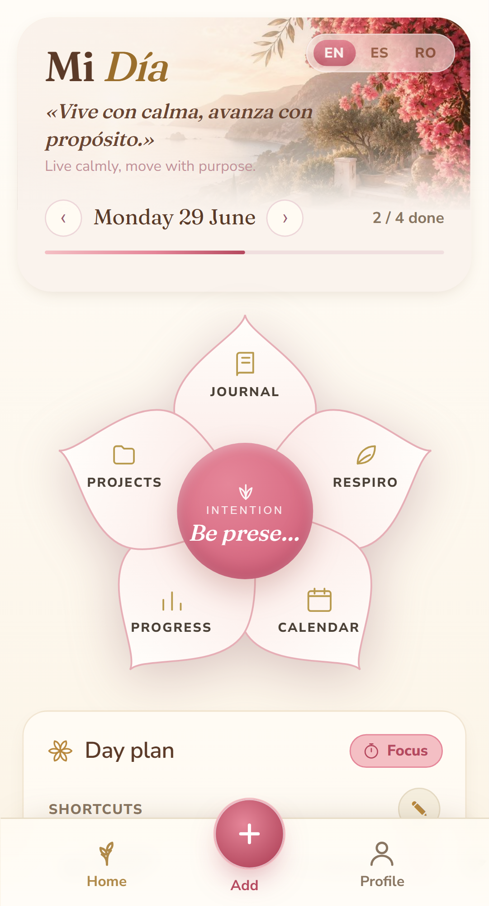
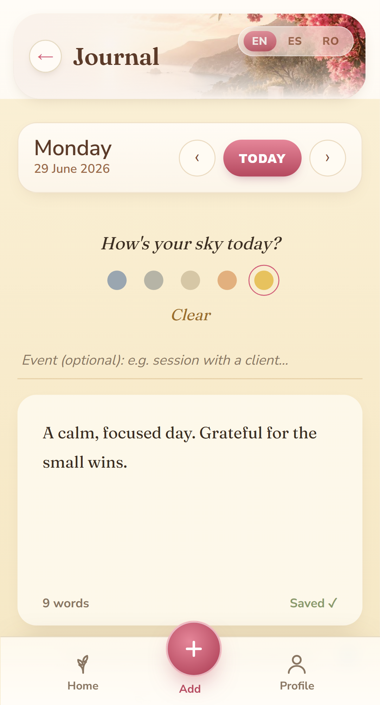
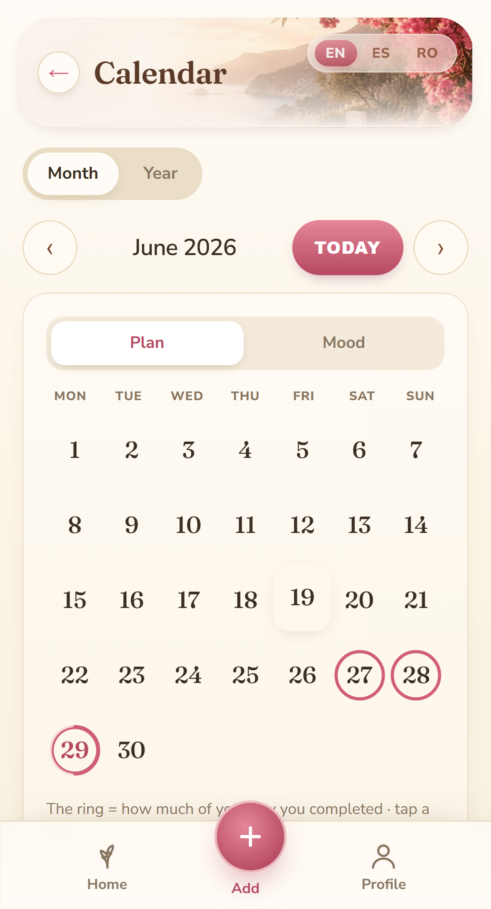
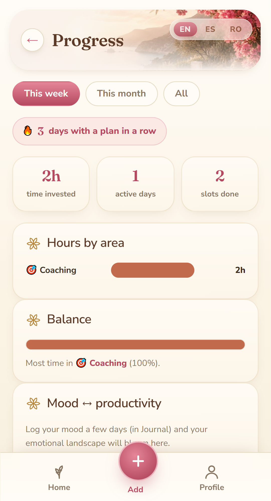

# Mi Día 🌿

> A Mediterranean-themed daily planner & reflective-journal PWA — built as a **single self-contained HTML file**, with a full **Playwright e2e suite** and a **CI/CD pipeline** gating every change.

**🔗 Live app:** https://mi-dia-app.pages.dev &nbsp;·&nbsp; **📱 Installable PWA** (works offline)


-lightgrey)


---

## Why this repo might interest you

I'm a **QA / AI professional**, and I built this as a real, shipped product to practise engineering and quality end-to-end — not a toy. The interesting part isn't just the app; it's **how it's tested and shipped**:

- ✅ **64 end-to-end tests across 17 specs** (Playwright, mobile-Chromium) covering every view and deep user flows — assertions on both the **DOM and the persisted data model**, not just "does it render".
- ♿ **Accessibility audited** with axe-core on a curated rule set across all 7 views; semantic locators (`getByRole`/`getByLabel`) drive the suite — testing the app the way a screen-reader user experiences it.
- 📸 **Visual-regression tests** (`toHaveScreenshot`) on the design-locked navigation.
- 🚦 **Layered quality gates in CI/CD** (GitHub Actions): a fast build-validation gate → **sharded** parallel test runs → a **pre-merge smoke gate** against the live Cloudflare preview deployment → a **post-deploy smoke** against production. A broken build cannot reach `main`, and `main` is **branch-protected**.
- 🧪 **Test-independence by design:** an *implementer* and a *black-box tester* meet only at a written contract (acceptance criteria + stable selector handles) — an anti-bias pattern documented in [`e2e/SPEC-TEMPLATE.md`](e2e/SPEC-TEMPLATE.md).
- 🤖 **AI-assisted engineering:** developed with Claude Code using a spec-driven workflow ([`CLAUDE.md`](CLAUDE.md) is the living spec) — designed, reviewed and verified in tight human-in-the-loop iterations.

> **Honest scope note:** the e2e suite covers logic / DOM / navigation / persistence / i18n / a11y in headless Chromium. Native-Android specifics (OS time pickers, backdrop blur, fonts, touch gestures) are validated by a manual device pass — and that limit is stated, not hidden. Knowing what your automation *doesn't* cover is part of the job.

---

## The app

Plan your day in time slots, with guided journaling, projects, a calendar, progress
stats, and calming/energizing breathing tools — with a focus on coaching reflection
and energy awareness. Fully **trilingual (EN · ES · RO)**. All data stays **local** in
the browser (localStorage); nothing is sent to any server.

**Highlights:** radial "flower" navigation · day planner with overlap-aware time slots ·
mood + emotion-wheel journaling with a 4F reflection scaffold · calendar "lenses" ·
consolidated progress view · opt-in cycle/rhythm tracking · Word/PDF & JSON backup.

### Screenshots

<table>
  <tr>
    <td width="50%" valign="top"><br><sub><b>Day</b> — flower navigation, daily phrase & plan</sub></td>
    <td width="50%" valign="top"><br><sub><b>Journal</b> — mood + reflective writing, autosave</sub></td>
  </tr>
  <tr>
    <td width="50%" valign="top"><br><sub><b>Calendar</b> — Plan / Mood lenses, completion rings</sub></td>
    <td width="50%" valign="top"><br><sub><b>Progress</b> — streak, hours by area, mood ↔ productivity</sub></td>
  </tr>
</table>

### Run it locally
It's a single file — just open [`index.html`](index.html) in your browser
(double-click, or drag it into Chrome). No install, no build step.

### Run the tests
```bash
cd e2e
npm ci
npx playwright install --with-deps chromium
npm test            # full suite
npm run report      # concise Markdown summary -> e2e/TEST-REPORT.md
npm run test:report # interactive HTML report
```

---

## Architecture & engineering choices

- **Single self-contained HTML file** (HTML + CSS + JS), **no build, no bundler, no npm,
  no backend.** A deliberate constraint: maximum portability, zero supply-chain surface,
  instant load. The only same-origin companion is `sw.js` (the PWA service worker, which
  browsers require to be a separate file).
- **Deployed on Cloudflare Pages**, auto-deploying from `main` on every push; `index.html`
  is the promoted build. One-click dashboard rollback as a safety net.
- **New features as self-contained modules** (e.g. [`cycle.js`](cycle.js)) following a
  clean 5-layer pattern (data / calc / i18n / view / wiring) with pure, testable calc
  functions — an incremental-migration approach over the single file, no big-bang rewrite.

### Data model (short)
- **Area** (`cat`): the life-area of an activity. One per slot. Editable, max 8.
- **Tag** (`tag`): cross-cutting context. Several per slot.
- **Slot / activity** (`block`): `{ id, title, cat, time, dur, tags[], done, date }`

The full design spec, decisions and changelog live in [`CLAUDE.md`](CLAUDE.md).

---

## Languages / Idiomas / Limbi

<details>
<summary><b>Español</b></summary>

Un planificador y diario mediterráneo: planifica tu día en franjas horarias, diario
guiado, proyectos, calendario, estadísticas y herramientas de calma. La app es un único
archivo — abre `index.html` en el navegador. Todos los datos se guardan localmente.
Copia de seguridad: pestaña **Día → Backup** (exporta/importa un `.json`).
</details>

<details>
<summary><b>Română</b></summary>

Un planner și jurnal mediteranean: planificarea zilei pe sloturi orare, jurnal ghidat,
proiecte, calendar, statistici și unelte de calm. Aplicația e un singur fișier — deschide
`index.html` în browser. Toate datele se salvează local. Backup: tab-ul **Zi → Backup**
(exportă/importă un `.json`).
</details>

---

## License

© 2026 Ines Patricia. Licensed under
**[CC BY-NC 4.0](https://creativecommons.org/licenses/by-nc/4.0/)** — you may share and
adapt this work for **non-commercial** purposes with attribution. Commercial use requires
permission. See [`LICENSE`](LICENSE).

---

<sub>Built by Ines — QA / AI professional. Code comments in English; the app UI is trilingual.</sub>
