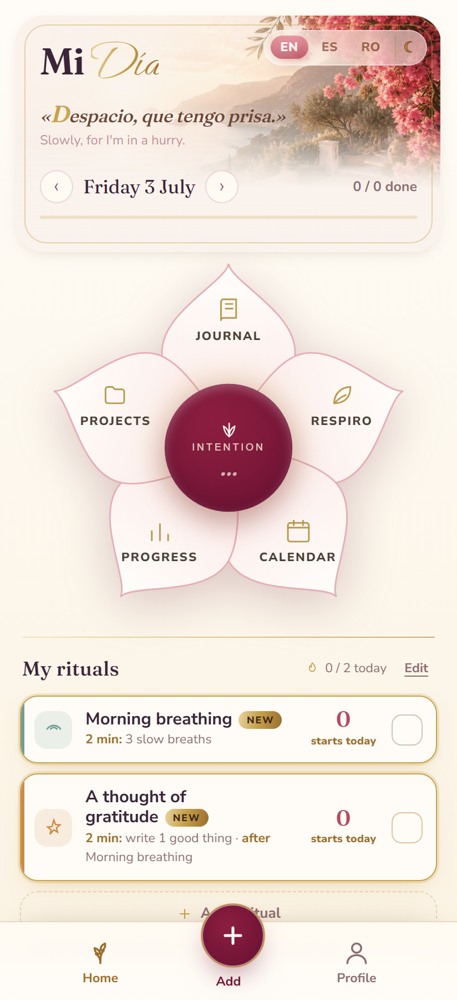
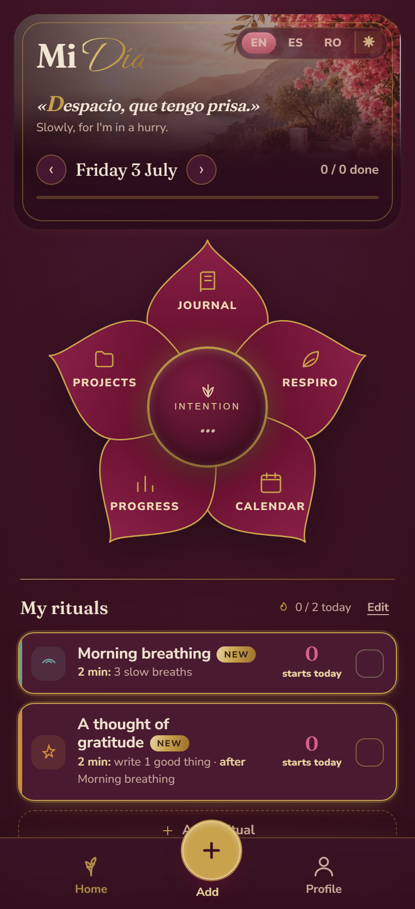
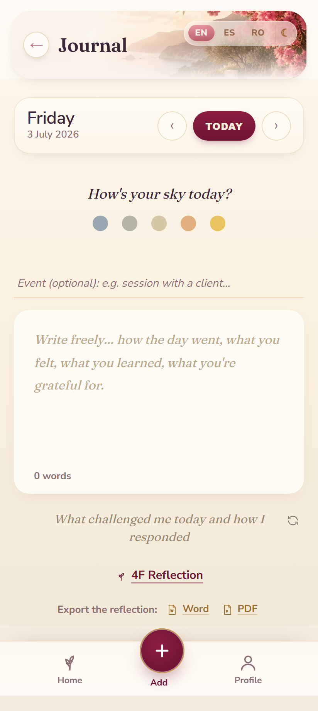
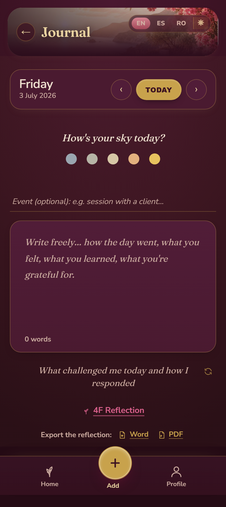
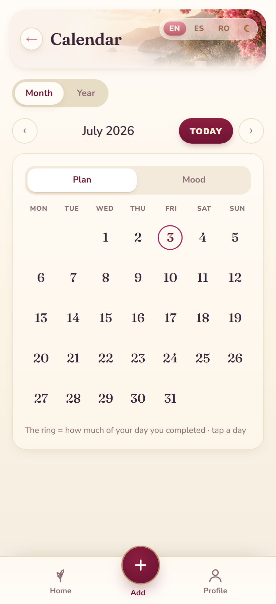
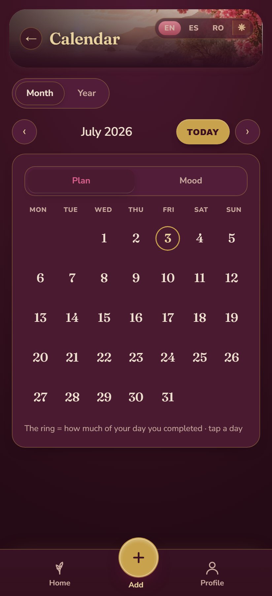
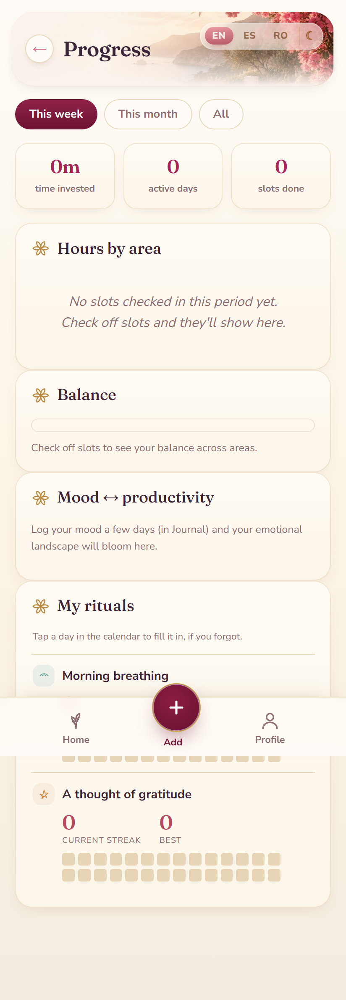
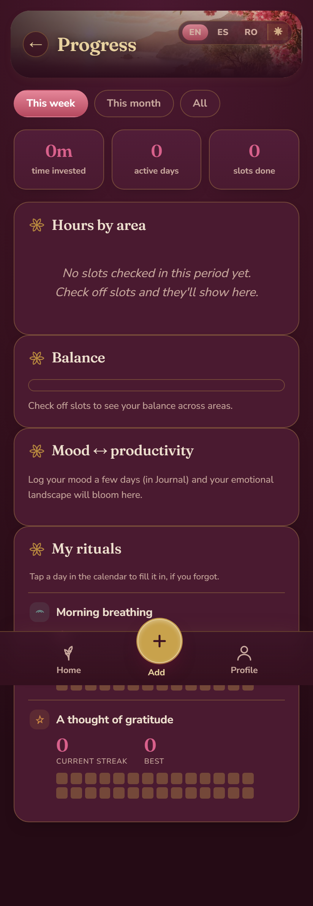

# Mi Día

A Mediterranean daily planner and reflective journal, built as a single self-contained HTML file
and shipped as an installable PWA. It works offline, stores everything in the browser, and sends
nothing to a server.

**Live:** https://mi-dia-app.pages.dev

[](https://github.com/InesPatricia/Mi-Dia-App/actions/workflows/e2e.yml)


-lightgrey)


---

## What this repository actually is

A real product, and a laboratory. I use it to try a quality practice at a scale where I own every
part of it, before I would propose that practice to a team that has to live with my mistakes.

The app is the subject. The interesting part is the system around it: what gates a change, what
just watches it, what happens when something breaks, and how long it takes me to find out.

I am a QA and AI engineer, so most of what follows is about how this thing is tested and shipped.
If you came for the app, it is at the bottom, and it is quite pretty.

---

## The constraint that shaped everything

The whole application is **one HTML file**: markup, styles and JavaScript in a single document. No
build step, no bundler, no npm at runtime, no backend. The only companion is `sw.js`, because
browsers insist a service worker be its own file and browsers do not negotiate.

That buys real things. The file opens by double-clicking it. There is no dependency tree to
compromise. The first paint costs one request. It also costs real things, and I would rather list
them than pretend they are not there:

- **No build step means no CSP nonces.** Per-response nonces need a build, so the
  Content-Security-Policy allows `unsafe-inline`. An accepted risk with compensating controls
  written down. Not an oversight, just a bill.
- **No modules means no cherry-picking a feature.** The served artifact is one whole file, so
  shipping feature A while holding feature B is not a `git cherry-pick`. Work is ordered instead so
  optional features land last, and a release targets whichever `mi-dia-vNN.html` is the clean cut.
- **One file grows.** New features are written as separate modules on a five-layer pattern (data,
  calc, i18n, view, wiring) with pure calc functions, then inlined. An incremental migration, not a
  rewrite, because rewrites are how projects die.

Deployment is Cloudflare Pages from `main`, with one-click rollback. The build output directory is
declared in `wrangler.toml`, not in the dashboard, so the layout and the setting that serves it move
together in one reviewable commit. Nobody can review a checkbox they cannot see. A permanent
`staging` branch gets its own preview on a separate subdomain, with its own cache, service worker
and storage.

---

## How it is tested

**83 end-to-end tests across 19 specs**, Playwright on mobile Chromium, because the app is
phone-first. A desktop viewport tests a layout nobody uses. Plus 7 smoke tests against the live
site.

I do not type that number. `quality/e2e/count-tests.js` asks the runner, and CI fails if the badge
above disagrees. Published numbers go stale; this one cannot. It asks the runner rather than
counting `test(` in the source, because that goes wrong in both directions at once: it misses tests
generated at runtime, and it counts things that were never tests (`/favicon/i.test(path)` is a regex
call having a bad day).

Tests check the DOM **and** the data the app persisted to localStorage, because a slot can look
perfect on screen and still have been saved with the wrong duration. `getByRole` and `getByLabel`
drive most of the suite, which puts the tests on the same path a screen reader takes; structural
selectors appear only where a control has no stable accessible name, with a comment wherever that
happens. axe-core runs across all views on a curated rule set covering names, roles, labels and
valid ARIA. Colour contrast sits outside it on purpose, because a rule that fires on every brand
colour trains you to ignore it, and then you ignore the one that mattered.

For larger features, the person writing the code and the person writing the tests work from the
same spec and never read each other's work
([template](quality/e2e/SPEC-TEMPLATE.md)). It removes author bias, so the tests describe the agreed
behaviour instead of the shipped implementation.

What the suite cannot reach gets its own list: [`docs/DEVICE-PASS.md`](docs/DEVICE-PASS.md),
organised by the reason each check exists rather than by screen.

---

## Gates and nets

The distinction I care most about: **a gate blocks, a net observes.** Gates run before merge with
zero tolerance. Nets run after and are tuned with headroom, because a check that cries wolf gets
ignored, and an ignored check also costs you the illusion of safety. Full picture, diagram included,
in [`docs/QA-ARCHITECTURE.md`](docs/QA-ARCHITECTURE.md).

**Gates.** A fast build-validation job (div balance, every inline script parses, no browser,
seconds), then the suite across two shards with two workers each, merging into one report. In
parallel, a smoke suite runs against the Cloudflare preview the pull request actually built.
Sharding and workers are different things and the config says so out loud: workers parallelise
across the cores of one machine, shards split the suite across machines. They multiply.

"Blocks the merge" is a claim about configuration, so here is the configuration. The required checks
on `main` are exactly `validate build`, `test (shard 1/2)`, `test (shard 2/2)` and `preview smoke`.
Anything else runs, reports, and stops precisely nothing, however gate-shaped it looks in a diagram.
The preview smoke sat in that state for a while: repaired once after an audit found it had never
fired, then left off the required list, so it ran green and enforced nothing. Repairing a check and
arming it are two separate acts, and I now know that in my bones.

**Nets.** After deploy, a smoke suite re-checks production once a small poller confirms the new
build is genuinely live, by watching the service worker for the expected cache name. A passive
security scan runs weekly. And `verify-live` opens the published README in a real browser and asks
the live site which paths it actually serves, because the two failure modes it looks for are
invisible locally: GitHub renders markdown client-side, and a static host answers 200 for paths it
does not publish. It found something on its first run, which is in the runbook.

The rule underneath all of it: **measure first, then set the threshold below the measurement.**

---

## Performance and security

Lighthouse CI asserts budgets after every deploy and on every pull request preview, so a regression
shows up before merge; the alternative is a bug report. Each threshold in
[`quality/perf/lighthouserc.cjs`](quality/perf/lighthouserc.cjs) carries the measured baseline it
came from in a comment beside it. A small k6 smoke baselines CDN delivery with one budget overall
and one per route, because a single slow file hides inside an aggregate when four fast ones average
it away. It asserts p(95). The mean hides the tail, and the tail is the part users feel.

A passive OWASP ZAP scan runs weekly against production: response inspection with no attack
payloads, the honest match for a static site with no backend to probe. Every finding becomes either
a shipped fix or a written accepted risk, and the accepted ones are encoded with `fail_action: true`,
which turns the scan into a tripwire: known findings stay quiet, any **new** one turns it red. The
full triage with before-and-after deltas is in
[`docs/SECURITY-NOTES.md`](docs/SECURITY-NOTES.md); the fixes ship through a hardened
[`public/_headers`](public/_headers).

---

## AI in the quality loop

Two different things, kept apart because interviews and blog posts love to blur them. Full write-up
in [`docs/AGENTIC-QA.md`](docs/AGENTIC-QA.md).

**AI as a tool here.** When the suite fails on a pull request, a triage agent correlates the diff
with the failing logs and posts one comment: likely cause, most suspect file, repro steps. It
updates that comment on re-runs, because nobody has ever been helped by a robot repeating itself.
Two decisions in it matter more than the feature. It is triggered by `workflow_run` and not
`pull_request`, so **untrusted input is handled by trusted code from `main`** and a hostile PR
cannot edit the agent into handing over the API key. And it fails safe: no key, log and exit zero. A
broken helper must never turn a pull request red. Only real gates get to do that.

**Testing a system that is itself agentic** is a different problem, and it lives in
[`quality/evals/`](quality/evals/) where it runs. A golden dataset is scored two ways: deterministic
property assertions, and an LLM judging the semantics properties cannot see. It passes on a
**pass-rate floor**, not per case, for the same reason k6 asserts p(95): with a non-deterministic
system, one unlucky case is noise and a dropped rate is a regression.

Two gaps are still open, and that directory's README says so: guardrail and prompt-injection cases,
and cost and latency treated as budgets.

---

## Internal tooling

Small scripts I wrote because I got tired of doing something by hand. This is the part of quality
work that never shows up in a test count and saves the most time.

| Tool | What it removes |
|---|---|
| `quality/e2e/validate-build.js` | Checks div balance and parses every inline script. The single-file format has no compiler, so this is the compiler. |
| `quality/e2e/count-tests.js` | Makes the published test count a verified fact, not a memory. |
| `quality/e2e/wait-for-deploy.js` | Polls until the CDN has actually published, so post-deploy smoke stops racing the deployment and losing. |
| `quality/e2e/theme-grid.js` | Screenshots every view in both themes as one review grid, which is how theme bugs get caught before they ship. |
| `quality/tools/check-docs.mjs` | Gates the documentation: dead links, stale test counts, build numbers written into a file that lives on three branches. |
| `quality/tools/verify-live.mjs` | Checks a page where it is actually served, because local rendering lies and a 200 proves nothing. |

Repeatable QA procedures live as executable checklists in `.claude/skills/`: a ZAP triage loop, a
performance run with a rule for when a threshold may be tightened, a pipeline audit, and the two
habits that cost me most to learn, which are verifying a claim where it runs and keeping two
branches from drifting apart. They exist so the reasoning survives me forgetting it, which it
reliably does.

---

## Repository layout

Six folders, each answering exactly one question. That rule is the whole design: if you cannot say
which question a file answers, it does not have a home yet.

| Folder | The question it answers |
|---|---|
| `public/` | **What ships?** The promoted build, the service worker, and the two files Cloudflare reads. This is the build output directory, so nothing else reaches the CDN. |
| `src/` | **What do I edit?** The versioned builds, and the module sources inlined into them. |
| `quality/` | **How is it verified?** End-to-end tests, performance budgets, the security scan config, the agentic-AI evals, and the tooling behind them. |
| `docs/` | **What does it mean?** Data schema, design system, current behaviour, security notes, runbook, and the full build archive. |
| `private/`, `scratch/` | Working notes and work in flight. Gitignored, never published. |

One consequence worth naming, because it looks like an inconsistency: `src/modules/*.js` are **not
loaded by the app**. They are readable sources inlined into the single-file build. They used to sit
in the root, where they looked exactly like application code and were served to every visitor.

---

## Documentation architecture

The project's context file had grown to 1,852 lines, and an agent read all of it before every
session. That was the visible problem. The real one was that the file had become an interface: five
other files read its internal structure, and nothing checked that what they read still existed.

Three defects were sitting in the repository at the same time, and nothing caught any of them.
Three skills routed work to a section heading that had been deleted. Two files stated different test
counts without either being wrong. And `Mi-Dia-App` and `Mi-Dia-QA` are worktrees of this repository
at different branches, so the same filename described two different states of the app: the QA
worktree was instructing agents to build a feature that had shipped fourteen commits earlier.

The fix was to split the file by audience, then treat the result the way the app is treated. As
something a machine checks. People forget; scripts do not.

```text
                          quality/tools/check-docs.mjs
                                       │
                        ┌──────────────┴──────────────┐
                        │        verifies each        │
                        ▼                             ▼
                   CLAUDE.md  ─────────────────►  CHANGELOG.md
              how to work here                   what changed
                        │                             │
        ┌───────────────┼───────────────┐             ▼
        ▼               ▼               ▼    docs/history/BUILD-LOG.md
docs/DATA_SCHEMA  docs/DESIGN_SYSTEM  docs/APP-REFERENCE      the archive
   what is stored   themes and tokens   how it behaves now
```

| File | Holds | Read by |
|---|---|---|
| `README.md` | why this exists and how it is engineered | people |
| `CHANGELOG.md` | what changed, per arc | people reviewing the work |
| `CLAUDE.md` | orientation, hard rules, where everything else is | agents, every session |
| `docs/*.md` | the depth: storage, design system, current behaviour | whoever needs it |
| `docs/history/BUILD-LOG.md` | every build since v23, verbatim | rarely anyone, but nothing was lost |

**Nothing that varies by branch is written down.** The current build, the test count and the current
arc are commands to run, not sentences to read, because a file shared by three branches cannot state
a build number without being wrong on two of them.

**Mandatory per-session context went from 170,934 bytes to 6,184**, a 96% reduction, with no history
lost. The archive is complete and a rule proves it.

`quality/tools/check-docs.mjs` runs in CI and fails the build on a dead path, a build number in the
router, a test count that disagrees with the runner, an archived section that went missing, or a
router that has forked between branches. It has **its own tests, including negative cases**, for the
reason in the first incident below: this repository has already shipped a gate that ran green
without checking anything, and a checker nobody checks is the same mistake wearing a different
filename.

---

## When it breaks

The incidents below are things I broke once. [`docs/RUNBOOK.md`](docs/RUNBOOK.md) is what to do when
something is wrong now: which build is genuinely live, how to roll back, what each red check means,
and the traps that make a good deploy look broken. A service worker serving you yesterday's app, for
instance, or a Cloudflare 200 that is really a fallback page wearing a convincing hat.

---

## Four things I got wrong

I keep an incident list because I forget things, and because the failures taught me more than the
features did.

**1. A gate that never ran.** I set up the pre-merge preview smoke, saw it go green, and moved on.
It was not firing. For weeks I had a check that looked like coverage and provided none. That is
worse than an empty slot in the pipeline. An empty slot at least makes you nervous. Now I audit the
pipeline itself on a schedule and confirm each check runs what I think it runs. I have found this
same failure twice since, which tells you how easy it is to miss.

**2. A dependency bump that exposed a dead runtime.** Dependabot proposed a routine Playwright
upgrade and it failed. I had left CI on Node 18, which had gone end of life without my noticing. The
bump was the messenger. CI moved to Node 20 that afternoon. This is most of the argument for keeping
routine updates switched on: they drag stale truths into the open on someone else's schedule.

**3. A CSP that would have broken fonts in production.** The service worker re-issues every GET
through `fetch()` inside the worker, and worker fetches are governed by the `connect-src` of the
policy delivered **on the `sw.js` response**, not on the page. My first draft used a plain
`connect-src 'self'`, which would have silently killed font loading for everyone. The branch preview
caught it before production did. That is the entire case for isolated previews, in one sentence.

**4. Screenshot baselines I let turn into fossils.** The two visual-regression tests are excluded
from CI because their baselines are OS-specific, so they only ever ran on my laptop. I last
regenerated them at build v143. The current build is v172: thirty versions and a full design-token
refactor later, with nothing checking them in between, until a Playwright upgrade invalidated the
lot without a single signal firing. A test that runs on one machine is a hobby with good intentions.

I am moving them to baselines generated on the CI runner, where the environment is pinned and the
check actually blocks. Whether runner-generated baselines hold steady across Playwright upgrades I
genuinely do not know yet, and I would rather say that than pretend the fix is finished. The
reassuring part: after thirty builds the drift was a single pixel. The test was worth having. It
just was not guarded by anything.

---

## What this does not cover

Knowing the limits of your own coverage is part of the job. The e2e suite covers logic, DOM,
navigation, persistence, i18n and accessibility in headless Chromium. Native Android specifics are
validated by a manual device pass. The k6 layer measures CDN delivery of a static PWA; there is no
backend to load. The ZAP scan is passive and is not a penetration test. Visual regression is
currently off, for the reason above.

---

## Running it

The app is one file. Open [`public/index.html`](public/index.html) in a browser. Nothing to install,
nothing to build, which is either refreshing or unsettling depending on your decade.

```bash
cd quality/e2e
npm ci
npx playwright install --with-deps chromium
npm test              # the functional suite
npm run count         # what the runner says the counts are
npm run validate      # structural check of the single-file build
npm run test:report   # open the interactive HTML report
```

---

## The app itself

Plan a day in time slots, with guided journaling, projects, a calendar, progress statistics, and
breathing tools for calming down or waking up. Fully trilingual in English, Spanish and Romanian.
All data stays in the browser.

Two complete themes on a moon and sun toggle: Light-luxe (champagne, wine and gilt) and Dark-velvet
(aubergine and gilt). Also: radial flower navigation, overlap-aware time slots, identity-based habit
rituals with streaks and habit stacking, a guided onboarding carousel, mood and emotion-wheel
journaling, calendar lenses, a consolidated progress view, optional cycle tracking, and Word, PDF
and JSON export.

<table>
  <tr><th width="50%">Light-luxe</th><th width="50%">Dark-velvet</th></tr>
  <tr>
    <td valign="top"><br><sub><b>Day</b>: flower navigation, daily phrase and rituals</sub></td>
    <td valign="top"><br><sub><b>Day</b> in dark-velvet</sub></td>
  </tr>
  <tr>
    <td valign="top"><br><sub><b>Journal</b>: mood and reflective writing, autosaved</sub></td>
    <td valign="top"><br><sub><b>Journal</b> in dark-velvet</sub></td>
  </tr>
  <tr>
    <td valign="top"><br><sub><b>Calendar</b>: plan and mood lenses, completion rings</sub></td>
    <td valign="top"><br><sub><b>Calendar</b> in dark-velvet</sub></td>
  </tr>
  <tr>
    <td valign="top"><br><sub><b>Progress</b>: streak, hours by area, mood against productivity</sub></td>
    <td valign="top"><br><sub><b>Progress</b> in dark-velvet</sub></td>
  </tr>
</table>

**Data model:** an **Area** (`cat`) is the life area an activity belongs to, one per slot, maximum
eight. A **Tag** is cross-cutting context, several per slot. A **Slot** (`block`) is
`{ id, title, cat, time, dur, tags[], done, date }`. Full contract in
[`docs/DATA_SCHEMA.md`](docs/DATA_SCHEMA.md), design system in
[`docs/DESIGN_SYSTEM.md`](docs/DESIGN_SYSTEM.md), current behaviour in
[`docs/APP-REFERENCE.md`](docs/APP-REFERENCE.md).

---

## Otros idiomas

<details>
<summary><b>Español</b></summary>

Un planificador y diario mediterráneo: planifica tu día en franjas horarias, diario guiado,
proyectos, calendario, estadísticas y herramientas de calma. La aplicación es un único archivo,
así que basta con abrir `index.html` en el navegador. Todos los datos se guardan localmente en el
dispositivo. Copia de seguridad desde la pestaña Día, opción Backup, que exporta e importa un
archivo `.json`.
</details>

<details>
<summary><b>Română</b></summary>

Un planner și jurnal mediteranean: planificarea zilei pe sloturi orare, ritualuri (obiceiuri cu
serie, în stil Atomic Habits), onboarding ghidat, jurnal ghidat, proiecte, calendar, statistici și
unelte de calm. Aplicația e un singur fișier, deci e destul să deschizi `index.html` în browser.
Toate datele se salvează local pe dispozitiv. Backup din tab-ul Zi, opțiunea Backup, care exportă
și importă un fișier `.json`.
</details>

---

## License

Copyright 2026 Ines Patricia. Licensed under
[CC BY-NC 4.0](https://creativecommons.org/licenses/by-nc/4.0/): share and adapt for non-commercial
purposes with attribution, commercial use by permission. See [`LICENSE`](LICENSE).

Code and comments are in English. The application interface is trilingual.
