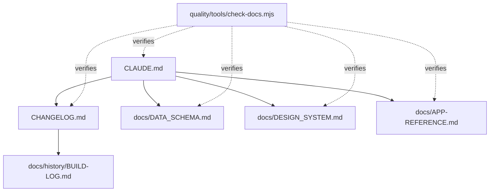

# Mi Día

A Mediterranean daily planner and reflective journal, built as a single self-contained HTML file
and shipped as an installable PWA. It works offline, stores everything in the browser, and sends
nothing to a server.

**Live:** https://mi-dia-app.pages.dev

[](https://github.com/InesPatricia/Mi-Dia-App/actions/workflows/e2e.yml)


-lightgrey)


---

## What this repository actually is

It is a real product with real users' worth of features, and it is also a laboratory. I use it to
try a quality practice at a scale where I own every part of it, before I would ever propose that
practice to a team. The app is the subject. The interesting part is the system around it: what
gates a change, what merely observes it, what happens when something breaks, and how I find out.

I am a QA and AI engineer. Most of what follows is about how this thing is tested and shipped,
not about what it does.

---

## The constraint that shaped everything

The whole application is **one HTML file**: markup, styles and JavaScript in a single document.
No build step, no bundler, no npm at runtime, no backend. The only companion is `sw.js`, because
browsers require a service worker to be its own file.

That constraint buys real things: the file opens by double-clicking it, there is no dependency
tree to be compromised, and the first paint costs one request. It also costs real things, and I
would rather list them than pretend they are not there:

- **No build step means no CSP nonces.** Computing a per-response nonce or hash requires a build,
  so the Content-Security-Policy has to allow `unsafe-inline` for scripts and styles. That is an
  accepted risk, written down with its compensating controls, not an oversight.
- **No modules means no cherry-picking a feature.** The served artifact is one whole file, so
  releasing feature A while holding feature B is not a `git cherry-pick`. Work is instead ordered
  so that optional features land last, and each `mi-dia-vNN.html` is a coherent, independently
  shippable snapshot. A release then targets an intermediate build.
- **One file grows.** New features are written as separate modules (`ritual.js`, `cycle.js`,
  `onboard.js`) on a five-layer pattern (data, calc, i18n, view, wiring) with pure calc functions,
  as an incremental migration rather than a rewrite.

Deployment is Cloudflare Pages, auto-publishing from `main` on every push, with one-click rollback
in the dashboard. Only `public/` is published — the promoted build, the service worker and the two
files Cloudflare reads for headers and redirects. Everything else in the repository is project
rather than product and never reaches the CDN. The build output directory is declared in
`wrangler.toml` rather than in the dashboard, so the layout and the setting that serves it change
together in one reviewable commit. A permanent `staging` branch gets its
own preview deployment on a separate subdomain, so its cache, service worker and localStorage are
fully isolated from production.

---

## How it is tested

**83 end-to-end tests across 19 specs**, Playwright on mobile Chromium, because the app is
phone-first and a desktop viewport would test a layout nobody uses. Plus 7 smoke tests that run
against the live site under a separate config.

That count is not a number I typed. `quality/e2e/count-tests.js` asks the runner
(`playwright test --list`) and CI fails if the badge above disagrees, so it cannot go stale. It
asks the runner rather than counting `test(` in the source because text-counting is wrong twice
over: it misses tests generated at runtime (the accessibility spec declares one test inside a loop
over six views) and it counts false positives (`/favicon/i.test(path)` is a regex call, not a test).

What the suite actually asserts:

- **Behaviour and stored state, not just rendering.** Tests assert the DOM *and* the data the app
  persisted to localStorage, so a slot that looks right on screen but was saved with the wrong
  duration still fails.
- **Semantic locators first.** `getByRole` and `getByLabel` drive most of the suite, which means
  the tests reach controls the way a screen reader does. Structural selectors are used only where
  a control has no stable accessible name, and where that happens it is commented.
- **Accessibility, scanned.** axe-core runs across all views on a curated rule set covering names,
  roles, labels and valid ARIA. Colour contrast is deliberately out of scope here and handled in a
  separate design review, because a rule that fires on every brand colour trains you to ignore it.
- **A written contract between implementer and tester.** For larger features, the person writing
  the code and the person writing the tests work from the same spec and never read each other's
  work: acceptance criteria plus the stable handles the implementation guarantees. The template is
  in [`quality/e2e/SPEC-TEMPLATE.md`](quality/e2e/SPEC-TEMPLATE.md). The point is removing author bias, so the
  tests describe the agreed behaviour rather than the shipped implementation.
- **Screenshot regression, currently off and honestly labelled.** See the fourth incident below.

---

## Gates and nets

The distinction I care most about: **a gate blocks, a net observes.** Gates run before merge and
have zero tolerance. Nets run after the fact and are tuned with headroom, because a check that
cries wolf gets ignored, and an ignored check is worse than none. The full picture, including the
diagram, is in [`docs/QA-ARCHITECTURE.md`](docs/QA-ARCHITECTURE.md).

**Gates.** A fast build-validation job (div balance and every inline script parses, no browser, no
dependencies, seconds), then the suite split across two parallel shards, each with two workers,
each emitting a blob report that a final job merges into one HTML report. In parallel, Cloudflare
builds a preview deployment for the pull request and a smoke suite runs against that real URL.

"Blocks the merge" is a claim about configuration, so here is the configuration. The required
status checks on `main` are exactly `validate build`, `test (shard 1/2)`, `test (shard 2/2)` and
`preview smoke`. Anything not on that list runs, reports, and stops nothing, however gate-like it
looks in a diagram. The preview smoke sat in exactly that state for a while: the workflow had
already been repaired once, after an audit found it had never fired at all, but nobody had added
it to the required list, so it ran green and enforced nothing. Repairing a check and arming it are
two separate acts. This is the failure mode I now check for by habit, because it is invisible from
the inside: everything looks green precisely because nothing is being tested.

Sharding and workers are different things and the config says so: workers parallelise across the
cores of one machine, shards split the suite across different machines. They multiply.

**Nets.** After deploy, a smoke suite re-checks production once Cloudflare has actually published
the new build (a small poller watches the live service worker for the expected cache name). A
passive security scan runs weekly.

The rule underneath all of it: **measure first, then set the threshold below the measurement**, so
real regressions ring and noise does not.

---

## Performance and security baselines

**Performance.** Lighthouse CI asserts budgets against the live URL after every deploy and against
each pull request's preview, so a regression shows up before merge rather than after. Every
threshold in [`quality/perf/lighthouserc.cjs`](quality/perf/lighthouserc.cjs) carries the measured baseline it was derived
from in a comment next to it, for example a 6500 ms budget for first contentful paint against a
5.2 s baseline. Alongside it, a deliberately polite k6 smoke ([`quality/perf/smoke.js`](quality/perf/smoke.js), 5
virtual users for 30 seconds) baselines CDN delivery, with one overall budget and one per route.
Per-route thresholds exist because a single slow file hides inside an aggregate p(95) when four
fast files average it away. It asserts p(95) rather than the mean, because the mean hides the tail
and the tail is what users feel.

**Security.** A passive OWASP ZAP baseline scan runs weekly against production. Passive means
response inspection with no attack payloads, which is the honest match for a static site with no
backend to probe. Every finding becomes either a shipped fix or a written accepted risk. Nothing
is silently ignored, and the full triage with before-and-after deltas is in
[`docs/SECURITY-NOTES.md`](docs/SECURITY-NOTES.md).

The fixes ship through a hardened [`public/_headers`](public/_headers) file: a CSP allow-list, anti-clickjacking,
HSTS, Permissions-Policy, COOP and CORP. The accepted risks are encoded in
[`quality/security/rules.tsv`](quality/security/rules.tsv) with `fail_action: true`, which turns the scan into a tripwire:
known findings stay quiet, any **new** finding turns the scan red. Accepting a new risk requires
both an entry in that file and a justification in the notes, never one without the other.

---

## AI in the quality loop

Two different things, kept separate because interviews and blog posts tend to blur them. The full
write-up is in [`docs/AGENTIC-QA.md`](docs/AGENTIC-QA.md).

**AI as a tool in this pipeline.** When the e2e suite fails on a pull request, a failure-triage
agent reads the diff and the failing logs, correlates them, and posts one comment with a likely
cause, the most suspect file and repro steps. It updates that comment on re-runs instead of
stacking new ones.

Two decisions in it are worth more than the feature. First, it is triggered by `workflow_run` and
not `pull_request`, so it executes the workflow file from the default branch: **untrusted input
(the pull request) is handled by trusted code (from `main`)**, and a hostile PR cannot edit the
agent to reach the API key or the write permission. Getting that wrong is a documented way secrets
leave CI. Second, it fails safe: with no API key it logs and exits zero, and any error is caught.
A broken helper must never turn a pull request red. Only real gates do that.

**Playwright's own agents** (planner, generator, healer) are scaffolded in `quality/e2e/.claude/agents/`
and drive the `playwright-test` MCP server. They draft plans and first-pass specs and propose
repairs. The hand-written deterministic suite stays the source of truth; the agents are for speed
at the edges, with a human reading every diff.

**Testing a system that is itself agentic**, which is a different problem, is handled in
[`quality/evals/`](quality/evals/) and it runs rather than being described. A golden dataset of inputs with
reference answers is scored two ways against a small extraction task: deterministic property
assertions (valid JSON, category within the allowed set, a time present only when one is implied)
and an LLM acting as judge for the semantics that properties cannot see. The suite passes on a
**pass-rate floor**, not per case, for the same reason the k6 layer asserts p(95) rather than the
mean: with a non-deterministic system, one unlucky case is noise and a dropped rate is a
regression. Missing an API key makes it no-op cleanly rather than turning a build red.

The honest gaps, which are listed in that directory's own README rather than glossed over:
guardrail and prompt-injection cases, and cost and latency treated as budgets.

---

## Internal tooling

Small scripts that exist because I got tired of doing something by hand. This is the part of
quality work that never shows up in a test count.

| Tool | What it removes |
|---|---|
| `quality/e2e/validate-build.js` | Checks div balance and parses every inline script. The single-file format has no compiler, so this is the compiler. |
| `quality/e2e/count-tests.js` | Makes the published test count a verified fact instead of a memory. |
| `quality/e2e/wait-for-deploy.js`, `wait-for-preview.js` | Polls until the CDN has actually published the build, so post-deploy smoke tests do not race the deployment. |
| `quality/e2e/make-report.js` | Turns a run into a short Markdown summary, for when the HTML report is more than you need. |
| `quality/e2e/shoot.js`, `quality/e2e/theme-grid.js` | Screenshots every view in both themes as one review grid, which is how theme bugs get caught before they ship. |
| `quality/tools/check-docs.mjs` | Gates the documentation: dead links, stale test counts, and build numbers written into a file that lives on three branches. |

There are also three repeatable QA procedures written as executable checklists in
`.claude/skills/`: a ZAP triage loop, a performance run with a rule for when a threshold may be
tightened, and a pipeline audit that encodes the incidents below. They exist so the reasoning
survives me forgetting it.

---

## Repository layout

Six folders, and each answers exactly one question. That rule is the whole design: if you cannot say
which question a file answers, it does not have a home yet.

| Folder | The question it answers |
|---|---|
| `public/` | **What ships?** The promoted build, the service worker, and the two files Cloudflare reads. This is the build output directory, so nothing else reaches the CDN. |
| `src/` | **What do I edit?** The versioned builds, and the module sources that are inlined into them. |
| `quality/` | **How is it verified?** End-to-end tests, performance budgets, the security scan config, the agentic-AI evals, and the tooling that supports them. |
| `docs/` | **What does it mean?** The data schema, the design system, current behaviour, the security notes, and the full build archive. |
| `private/` | Working notes. Gitignored; never published, never committed. |
| `scratch/` | Local work in progress — assets and experiments mid-flight. Gitignored. |

The root keeps only what has to be there: this file, the changelog, the licence, the agent's router,
and `wrangler.toml`, which tells Cloudflare that `public/` is the site.

One consequence worth naming, because it looks like an inconsistency: `src/modules/*.js` are **not
loaded by the app**. They are readable sources that get inlined into the single-file build, kept
under `src/` so nobody mistakes them for something the browser fetches. They used to sit in the
root, where they looked exactly like application code and were served to every visitor.

---

## Documentation architecture

The project's context file had grown to 1,852 lines, and an agent read all of it before every
session. That was the visible problem. The real one was that it had quietly become an interface:
five other files read its internal structure, and nothing checked that what they read still existed.

Three defects were present in the repository at the same time, and none of them was caught by
anything:

- Three skills routed work to a section heading that had been deleted.
- Two files stated different test counts without either being wrong, and nothing reconciled them.
- `Mi-Dia-App` and `Mi-Dia-QA` are worktrees of this repository at different branches, so the same
  filename described two different states of the app. The QA worktree was instructing agents to build
  a feature that had shipped on `staging` fourteen commits earlier.

The fix was to split the file by audience, and then to treat the result the way the app is treated —
as something a machine checks, not something a person remembers.


```mermaid
flowchart TB
    ROUTER["CLAUDE.md"]
    ROUTER --> LOG["CHANGELOG.md"]
    LOG --> ARCHIVE["docs/history/BUILD-LOG.md"]
    ROUTER --> SCHEMA["docs/DATA_SCHEMA.md"]
    ROUTER --> DESIGN["docs/DESIGN_SYSTEM.md"]
    ROUTER --> REF["docs/APP-REFERENCE.md"]
    GATE["quality/tools/check-docs.mjs"] -. verifies .-> ROUTER
    GATE -. verifies .-> SCHEMA
    GATE -. verifies .-> DESIGN
    GATE -. verifies .-> REF
    GATE -. verifies .-> LOG
```

The router names the file; the table names what is in it.

| File | Holds | Read by |
|---|---|---|
| `README.md` | why this exists and how it is engineered | people |
| `CHANGELOG.md` | what changed, per arc | people reviewing the work |
| `CLAUDE.md` | orientation, hard rules, where everything else is | agents, every session |
| `docs/*.md` | the depth: storage, design system, current behaviour | whoever needs it |
| `docs/history/BUILD-LOG.md` | every build since v23, verbatim | rarely anyone, but nothing was lost |

**Nothing that varies by branch is written down.** The current build, the test count and the current
arc are commands to run, not sentences to read, because a file shared by `main`, `staging` and the QA
branches cannot state a build number without being wrong on two of them.

**The mandatory per-session context went from 170,934 bytes to 6,184** — a 96% reduction — with no
history lost. The archive is complete and a rule proves it.

`quality/tools/check-docs.mjs` runs in CI and fails the build on a dead path, a build number in the router,
a test count that disagrees with the runner, an archived section that went missing, or a router that
has forked between branches. It has **its own tests, including negative cases**, for the reason given
in the first incident below: this repository has already shipped a gate that ran green without
checking anything, and a checker nobody checks is the same mistake with a different filename.

---

## When it breaks

The incidents below are what went wrong once. [`docs/RUNBOOK.md`](docs/RUNBOOK.md) is what to do
when something goes wrong now: how to find out which build is actually live, how to roll back, what
each red check is telling you, and the traps that make a working deploy look broken — a service
worker serving you yesterday's app, or a Cloudflare 200 that is really a fallback.

---

## Four things that went wrong

The most useful section here, and the reason I keep an incident list at all.

**1. A gate that never ran.** The pre-merge preview smoke was configured, visible and green, and
it was not firing. It looked like coverage while providing none. That is worse than having no
gate, because you stop looking. The lesson generalised into a habit: audit the pipeline itself,
periodically and deliberately, and confirm that each check runs what you believe it runs.

**2. A dependency bump that exposed a dead runtime.** Dependabot proposed a routine Playwright
upgrade, and it failed because CI was still on Node 18, which had reached end of life. The bump
was not the problem, it was the messenger. CI moved to Node 20. Routine dependency updates are
worth having partly because they force this kind of truth to the surface.

**3. A CSP that would have broken fonts in production.** The service worker re-issues every GET
through `fetch()` inside the worker, and worker fetches are governed by the `connect-src` of the
policy delivered **on the `sw.js` response**, not on the page. A plain `connect-src 'self'` would
have silently killed font loading. Caught on a branch preview, before production, which is the
entire argument for having isolated previews.

**4. Screenshot baselines that had quietly become fossils.** The two visual-regression tests were
excluded from CI because their baselines are OS-specific, so they only ever ran on my laptop. They
were last regenerated at build v143. The current build is v172, roughly thirty versions and a full
design-token refactor later. Nothing had checked them in between, and a routine Playwright upgrade
invalidated them without a single signal firing. A test that runs on one machine is not a gate.
They are being moved to baselines generated on the CI runner, where the environment is pinned and
the check actually blocks, and regenerating a baseline is now a deliberate, reviewable action
rather than something anyone can do silently. The reassuring detail: after thirty builds the drift
was one pixel, so the test was worth having. It just was not guarded by anything.

---

## What this automation does not cover

Knowing the limits of your own coverage is part of the job, so these are stated rather than hidden.

The e2e suite covers logic, DOM, navigation, persistence, i18n and accessibility in headless
Chromium. Native Android specifics (OS time pickers, backdrop blur, system fonts, touch gestures)
are validated by a manual device pass. The k6 layer measures CDN and edge delivery of a static
PWA: this app has no backend, so once five files have arrived everything is client-side, which is
the e2e suite's job. The ZAP scan is passive only and is not a penetration test. Visual regression
is currently off, for the reason given above.

---

## Running it

The app is one file. Open [`public/index.html`](public/index.html) in a browser. There is nothing to install and
nothing to build.

The tests:

```bash
cd e2e
npm ci
npx playwright install --with-deps chromium
npm test              # the functional suite
npm run count         # what the runner says the counts are
npm run validate      # structural check of the single-file build
npm run test:report   # open the interactive HTML report
```

---

## The app itself

Plan a day in time slots, with guided journaling, projects, a calendar, progress statistics, and
breathing tools for calming or energising. Fully trilingual in English, Spanish and Romanian. All
data stays in the browser and nothing is sent anywhere.

Two complete themes, switchable from a moon and sun toggle: Light-luxe (champagne, wine and gilt)
and Dark-velvet (aubergine and gilt). Other features: a radial flower navigation, overlap-aware
time slots, identity-based habit rituals with streaks and habit stacking, a guided onboarding
carousel, mood and emotion-wheel journaling with a reflection scaffold, calendar lenses, a
consolidated progress view, optional cycle tracking, and Word, PDF and JSON export.

<table>
  <tr><th width="50%">Light-luxe</th><th width="50%">Dark-velvet</th></tr>
  <tr>
    <td valign="top"><br><sub><b>Day</b>: flower navigation, daily phrase and rituals</sub></td>
    <td valign="top"><br><sub><b>Day</b> in dark-velvet</sub></td>
  </tr>
  <tr>
    <td valign="top"><br><sub><b>Journal</b>: mood and reflective writing, autosaved</sub></td>
    <td valign="top"><br><sub><b>Journal</b> in dark-velvet</sub></td>
  </tr>
  <tr>
    <td valign="top"><br><sub><b>Calendar</b>: plan and mood lenses, completion rings</sub></td>
    <td valign="top"><br><sub><b>Calendar</b> in dark-velvet</sub></td>
  </tr>
  <tr>
    <td valign="top"><br><sub><b>Progress</b>: streak, hours by area, mood against productivity</sub></td>
    <td valign="top"><br><sub><b>Progress</b> in dark-velvet</sub></td>
  </tr>
</table>

### Data model, in short

- **Area** (`cat`): the life area an activity belongs to. One per slot, editable, maximum eight.
- **Tag** (`tag`): cross-cutting context. Several per slot.
- **Slot** (`block`): `{ id, title, cat, time, dur, tags[], done, date }`

The full contract is in [`docs/DATA_SCHEMA.md`](docs/DATA_SCHEMA.md), with the design system in
[`docs/DESIGN_SYSTEM.md`](docs/DESIGN_SYSTEM.md) and current behaviour in
[`docs/APP-REFERENCE.md`](docs/APP-REFERENCE.md).

---

## Otros idiomas

<details>
<summary><b>Español</b></summary>

Un planificador y diario mediterráneo: planifica tu día en franjas horarias, diario guiado,
proyectos, calendario, estadísticas y herramientas de calma. La aplicación es un único archivo,
así que basta con abrir `index.html` en el navegador. Todos los datos se guardan localmente en el
dispositivo. Copia de seguridad desde la pestaña Día, opción Backup, que exporta e importa un
archivo `.json`.
</details>

<details>
<summary><b>Română</b></summary>

Un planner și jurnal mediteranean: planificarea zilei pe sloturi orare, ritualuri (obiceiuri cu
serie, în stil Atomic Habits), onboarding ghidat, jurnal ghidat, proiecte, calendar, statistici și
unelte de calm. Aplicația e un singur fișier, deci e destul să deschizi `index.html` în browser.
Toate datele se salvează local pe dispozitiv. Backup din tab-ul Zi, opțiunea Backup, care exportă
și importă un fișier `.json`.
</details>

---

## License

Copyright 2026 Ines Patricia. Licensed under
[CC BY-NC 4.0](https://creativecommons.org/licenses/by-nc/4.0/): you may share and adapt this work
for non-commercial purposes with attribution. Commercial use requires permission. See
[`LICENSE`](LICENSE).

Code and comments are in English. The application interface is trilingual.
