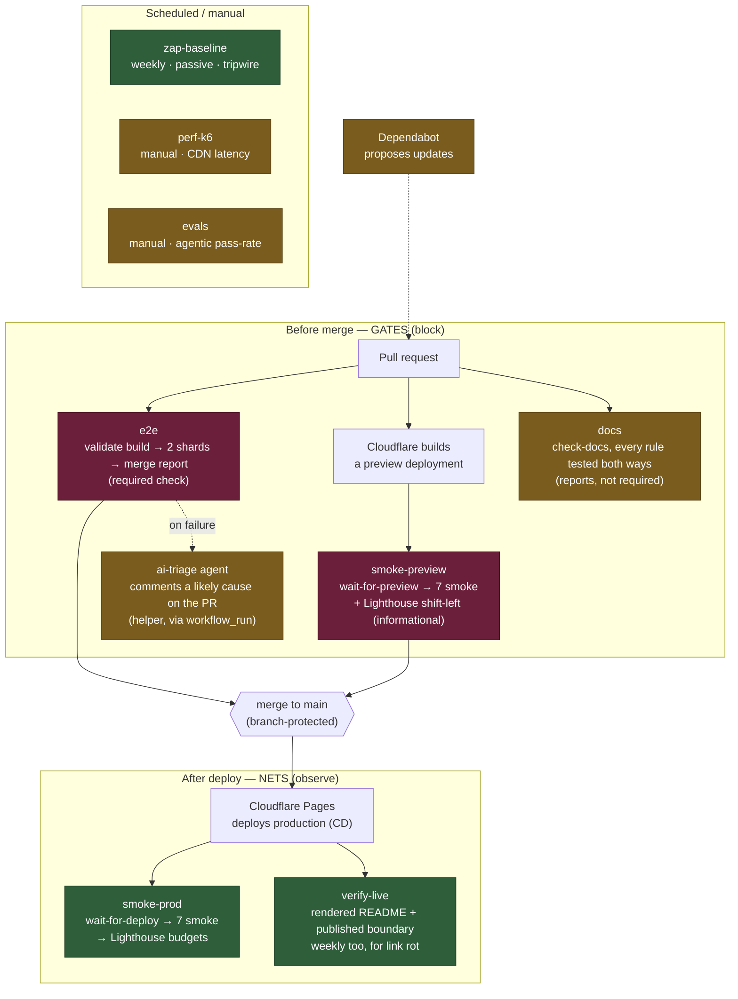

# QA architecture — gates and nets

The whole quality pipeline in one picture. The core distinction: **gates block** (a red gate stops
a change before it reaches `main`), while **nets observe** (they run after the fact and report,
tuned to tolerate noise so they don't cry wolf). Getting that calibration right — zero tolerance on
gates, budgets-with-headroom on nets — is a deliberate design choice, not an accident.

## Reading it

- **Gates (wine):** `e2e` and `smoke-preview` run on every PR; `main` is branch-protected, so a red
  gate physically stops the merge. Zero tolerance — these must be green.

  "Blocks the merge" is a claim about **configuration**, not about intent, so here is the
  configuration it rests on. The required status checks on `main` are exactly:
  `validate build`, `test (shard 1/2)`, `test (shard 2/2)`, `preview smoke`.
  Anything not on that list runs and reports but does not block, however gate-like it looks in a
  diagram. `smoke-preview` spent a while in precisely that state: the workflow had been repaired
  after it was found never to fire, but it was never added to the required list, so it ran green
  and stopped nothing. Verify this list against the branch-protection settings, not against the
  existence of a workflow file — a workflow and a rule that enforces it are two different things.

  Two steps were added to the `e2e` workflow after phase 6, and they sit on opposite sides of this
  line on purpose. **The type check is a gate**: `npx tsc --noEmit` runs inside the `test` job,
  which is required, so a typo in the page object layer stops a merge. **The mutation net is not**:
  `node quality/tools/mutate.mjs --net` runs with `continue-on-error`, because the decisions table
  in `QA-STATUS.md` rejected making the audit a required check on the grounds that its failure is
  information rather than a reason to block. Same workflow, different jobs to do.
- **Nets (green):** `smoke-prod` re-checks the live site after deploy; `verify-live` opens the
  published README in a real browser and asks the live site which paths it actually serves;
  `zap-baseline` scans weekly. They report and, where budgets apply, fail only on hard regressions —
  headroom is built in so network noise doesn't raise false alarms.

  `verify-live` cannot be a gate, and the reason is worth stating: both things it looks at only
  exist *after* a merge. GitHub renders the README from the default branch, and Cloudflare publishes
  on push. It also draws the gate/net line inside itself. A file served by the **origin** means the
  `public/` boundary broke, which is a defect in this repository, so it fails. A file served only
  from the **CDN's cache** is a copy taken before that file was withdrawn, expiring under a TTL
  nothing here can shorten — so it warns, with the hours remaining, and the run stays green. Failing
  over something nobody can act on is how a check gets ignored on the day it matters.
- **Helpers (gold):** the `ai-triage` agent (explains a failure), `evals` (agentic pass-rate),
  `perf-k6` (latency baseline), Dependabot (proposes updates), and `docs` assist but never block.

  **`docs` is in the helper column deliberately, and that is a finding rather than a design.** The
  workflow does fail on a broken rule, and it runs on every pull request — but it is not on the
  required-checks list, so a red run reports and stops nothing. By this document's own standard that
  makes it a reporter, not a gate. Adding `check docs` to the required checks is a settings change,
  not a code change, and it is the one thing that would make the documentation genuinely gated
  rather than merely checked.

## Four levels

Gates and nets is one axis: **when** a check runs and whether it can stop a merge. The four levels
are the other axis: **what a check holds still** while it varies one thing. A suite that only thinks
about the first axis ends up with every question asked in a browser, because a browser can answer
all of them, slowly and with the most moving parts.

They are named here because the arc that built them found the naming was doing work. Two of these
levels did not exist before it, and the pull that created them was not "we should have more tests"
but "this question is being asked at the wrong height".

| Level | Where it lives | What it holds still | How to run it |
|---|---|---|---|
| Unit | `quality/unit/` | no browser, no storage, no interface: one pure function and its arithmetic | `cd quality/unit && node --test` |
| Integration | `quality/e2e/tests-integration/` | a real browser, but no navigation and no clicks: what the application writes to `localStorage`, and what a backup file does to it | `npx playwright test --project=integration` |
| End to end | `quality/e2e/tests/` | the whole application, driven the way a person drives it, through the page object layer | `npx playwright test --project=mobile-chromium` |
| Delivery | `quality/e2e/tests-prod/` | not the code at all: whether the thing that got published is the thing that was tested | `npx playwright test --config=playwright.prod.config.js` |

### What each one is actually for

**Unit** is the only level where a calculation can be checked at every boundary cheaply. It runs a
module from `src/modules/` in a `vm` sandbox whose global object starts empty, which is the part
worth knowing: those files are not standalone, they are inlined into the application's own closure
and read host globals from it. Running the calc surface in a context that holds none of those is
what turns "this block is pure" from a comment into a fact. If a block ever reaches for `Store` or
`document`, the load throws instead of quietly resolving against whatever Node happens to have.

**Integration** is a browser with nothing above the storage boundary. No view changes, no assertions
about appearance. The contract it checks is the one between the application's own code and
`localStorage`, and a browser is still the right host for it, because running that code anywhere
else would be checking a copy of it rather than the thing that ships. `storage-schema.spec.js`
parses the key table out of [`DATA_SCHEMA.md`](DATA_SCHEMA.md), so a key written without a documented
row turns the suite red: the document is the assertion, not a description of one.

**End to end** is where the questions live that only have an answer in a whole application: does
this flow work, does the data survive a reload, can a keyboard get out of this dialog. It is the
most expensive level and the one that grows without limit if nobody holds a line on it.

**Delivery** is the one that gets folded into end to end by mistake, and the decisions table refused
that fold on purpose. It is not asking whether the code is correct. It is asking whether the
artifact that reached production is the artifact that was checked, which is a different failure with
different causes: a promotion that copied the wrong file, a service worker naming a cache that no
longer matches, a CDN still serving something that was withdrawn. `validate-build.js` and
`serve-build.js` are at this level even though neither drives a browser, because both answer that
same question before a build is promoted rather than after.

### The rule that keeps this from being decoration

**Every new case goes to the lowest level that can hold it.** That is what stops the end-to-end
suite from absorbing everything, and it is the reason the arithmetic that used to be asserted in a
browser now sits in `quality/unit/` where every boundary is cheap to check.

The rule has an obvious failure mode, and it is worth naming: a case pushed down to a level that
cannot see it is coverage that has left the building while every signal stays green. Two of those
were found here, and not by reading the suite.

### What tells you a level is actually catching anything

`node quality/tools/mutate.mjs` breaks the application on purpose, one defect at a time, and records
which levels go red. A level that stays green under a mutant that reached it is a level that is not
doing its job, whatever its test count says.

That audit is what found both holes this arc closed last. The write that gives a new user their two
default rituals could be deleted entirely and the whole functional suite still passed, because every
ritual spec seeded its own data and the application's seed path was therefore never taken. The cycle
phase boundary could move by a day and only the unit level noticed, although the phase is on screen.
Neither is visible by reading a suite and counting what it covers, because both look covered.

Both are closed now, at the level where a user would meet them, and both were accepted the same way
every check in this pipeline is: the mutant was applied to the build by hand, the new test went red,
and the build was restored from a copy taken before the edit.

## Why the shapes are what they are

This document says which check runs where. The reasoning behind the shape of each one, why the
production net is smoke-only and the pre-merge gate is deep, what separates smoke from sanity, and
which variable each kind of test actually holds still, is in
[`testing-notes.md`](testing-notes.md).

It is worth reading once before arguing with any threshold in here, because most disagreements about
a check turn out to be disagreements about which of those two jobs it was meant to do.

## The one rule

Measure first, then set thresholds below the measurement so real problems ring the alarm and noise
doesn't — and audit the pipeline itself, because a gate that never runs is worse than no gate: it
looks like coverage while providing none.
