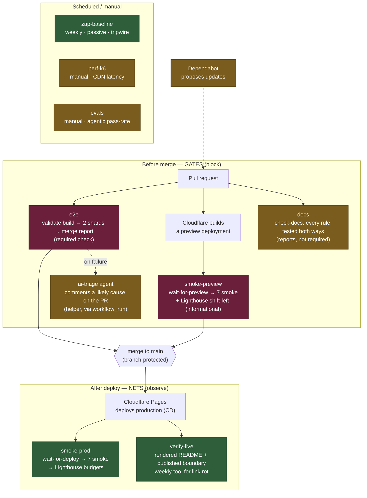

# QA architecture — gates and nets

The whole quality pipeline in one picture. The core distinction: **gates block** (a red gate stops
a change before it reaches `main`), while **nets observe** (they run after the fact and report,
tuned to tolerate noise so they don't cry wolf). Getting that calibration right — zero tolerance on
gates, budgets-with-headroom on nets — is a deliberate design choice, not an accident.

## Reading it

- **Gates (wine):** `e2e` and `smoke-preview` run on every PR; `main` is branch-protected, so a red
  gate physically stops the merge. Zero tolerance — these must be green.

  "Blocks the merge" is a claim about **configuration**, not about intent, so here is the
  configuration it rests on. The required status checks on `main` are exactly:
  `validate build`, `test (shard 1/2)`, `test (shard 2/2)`, `preview smoke`.
  Anything not on that list runs and reports but does not block, however gate-like it looks in a
  diagram. `smoke-preview` spent a while in precisely that state: the workflow had been repaired
  after it was found never to fire, but it was never added to the required list, so it ran green
  and stopped nothing. Verify this list against the branch-protection settings, not against the
  existence of a workflow file — a workflow and a rule that enforces it are two different things.
- **Nets (green):** `smoke-prod` re-checks the live site after deploy; `verify-live` opens the
  published README in a real browser and asks the live site which paths it actually serves;
  `zap-baseline` scans weekly. They report and, where budgets apply, fail only on hard regressions —
  headroom is built in so network noise doesn't raise false alarms.

  `verify-live` cannot be a gate, and the reason is worth stating: both things it looks at only
  exist *after* a merge. GitHub renders the README from the default branch, and Cloudflare publishes
  on push. It also draws the gate/net line inside itself. A file served by the **origin** means the
  `public/` boundary broke, which is a defect in this repository, so it fails. A file served only
  from the **CDN's cache** is a copy taken before that file was withdrawn, expiring under a TTL
  nothing here can shorten — so it warns, with the hours remaining, and the run stays green. Failing
  over something nobody can act on is how a check gets ignored on the day it matters.
- **Helpers (gold):** the `ai-triage` agent (explains a failure), `evals` (agentic pass-rate),
  `perf-k6` (latency baseline), Dependabot (proposes updates), and `docs` assist but never block.

  **`docs` is in the helper column deliberately, and that is a finding rather than a design.** The
  workflow does fail on a broken rule, and it runs on every pull request — but it is not on the
  required-checks list, so a red run reports and stops nothing. By this document's own standard that
  makes it a reporter, not a gate. Adding `check docs` to the required checks is a settings change,
  not a code change, and it is the one thing that would make the documentation genuinely gated
  rather than merely checked.

## Where the code lives

Two directories on this machine look like two projects and are not. They are **two worktrees of one
git repository**, checked out at different branches. Same history, same remote, two windows open at
once.

| Directory | Branch | What it is for |
|---|---|---|
| `Mi-Dia-App` | `staging` | the product arc, one feature slice at a time |
| `Mi-Dia-QA` | `main` | shipped production, plus the gates, tools and documentation |

**Why two rather than one.** The application is a single self-contained HTML file. Working on a
feature and on the test infrastructure in the same folder means a `git checkout` between every
context switch, with a stash on each side. Two worktrees give two live contexts instead. The only
physical difference beyond the branch is that the product worktree also holds the gitignored corpus
it needs and this one does not.

**Work flows one way: a branch, then `main`, then `staging`.** `main` carries the structure and
`staging` carries the product, which is usually behind on all of it. Merging `staging` into `main`
would revert structure in bulk and silently. The product reaches production through a promoted
build, not through a branch merge. When the two drift far enough that rule 6 of the documentation
gate reports the router has forked, that is the reconciliation asking to happen.

**The layout, at the top level.** 113 tracked files, and every one of them sits in a directory whose
name says what it is:

| Path | What it holds |
|---|---|
| `public/` | what is actually served: the promoted build, the service worker, headers, redirects |
| `src/` | the source build and the feature modules that get inlined into it |
| `docs/` | the documentation, its history and its screenshots |
| `quality/` | everything that checks something |
| `.github/` | the workflows |
| `.claude/` | the skills a session can invoke |
| `.githooks/` | the local guard that runs before a commit |
| `CLAUDE.md` | the session router: what is true on every branch, and nothing that changes per build |

**Builds are numbered, and only the current one stays on disk.** Thirty one build files have existed
across this repository's history and one is tracked at a time. That is deliberate and it is not a
contradiction of the never-edit-in-place rule: the rollback point is the git history, not a pile of
files in `src/`. A previous build is recovered with `git show`, not by looking for it in a listing.

## What lives in quality/, and why it is one directory

There is no `tests/` at the root, no `scripts/`, no `ci/`. Everything that verifies anything lives in
one place, split by **the question it answers** rather than by the technology that answers it.

| Subsystem | Files | The question |
|---|---|---|
| `quality/e2e/` | 41 | does the feature work? |
| `quality/tools/` | 7 | do the gates themselves work? |
| `quality/evals/` | 4 | does the AI part of the loop produce good results? |
| `quality/perf/` | 2 | is it fast enough? |
| `quality/security/` | 1 | which risks are accepted, and which are new? |

`quality/tools/` is the row worth pointing at when someone asks what is unusual here. It holds the
checkers, and every one of them ships with its own test file. A gate is a claim that something is
true; a gate nobody has watched fail is an untested claim wearing the costume of a check.

Inside `quality/e2e/`, the same idea applies one level down. `tests/` is the reviewed suite that
gates every merge. `tests-generated/` is the quarantine where agent-drafted tests land and gate
nothing. `tests-prod/` is the post-deploy smoke, which runs against a live URL under its own config.
Three directories because they answer three different questions and none of them ever run together.
The full account of the agent half is in [`AGENTIC-QA.md`](AGENTIC-QA.md).

## Two things called a spec

The word appears twice in this repository and means two opposite things. Getting them confused is
the most likely misreading of the whole layout.

| | [`SPEC-TEMPLATE.md`](../quality/e2e/SPEC-TEMPLATE.md) | `quality/e2e/specs/*.plan.md` |
|---|---|---|
| Written by | a person | the planner agent |
| Written when | **before** the feature exists | **after** it exists |
| Source of truth | the agreed behaviour | the running application |
| Used for | keeping implementer and tester honest | drafting tests to generate |

They sit at opposite ends of the same feature. One precedes the code and describes what it should
do; the other follows the code and describes what it does.

**That difference is also the risk, and it is worth saying out loud.** An agent-written plan takes
the running application as ground truth, so if a feature shipped with a defect, the plan records the
defect as the specification and the generated test will defend it against its own fix. Nothing in
the agent pipeline can catch that, because the agent has no idea what the feature was supposed to
do. A human-written feature spec is the only thing that does, which is why the older artifact is not
superseded by the newer one. They cover different failures.

## Why the shapes are what they are

This document says which check runs where. The reasoning behind the shape of each one, why the
production net is smoke-only and the pre-merge gate is deep, what separates smoke from sanity, and
which variable each kind of test actually holds still, is in
[`testing-notes.md`](testing-notes.md).

It is worth reading once before arguing with any threshold in here, because most disagreements about
a check turn out to be disagreements about which of those two jobs it was meant to do.

## The one rule

Measure first, then set thresholds below the measurement so real problems ring the alarm and noise
doesn't — and audit the pipeline itself, because a gate that never runs is worse than no gate: it
looks like coverage while providing none.
